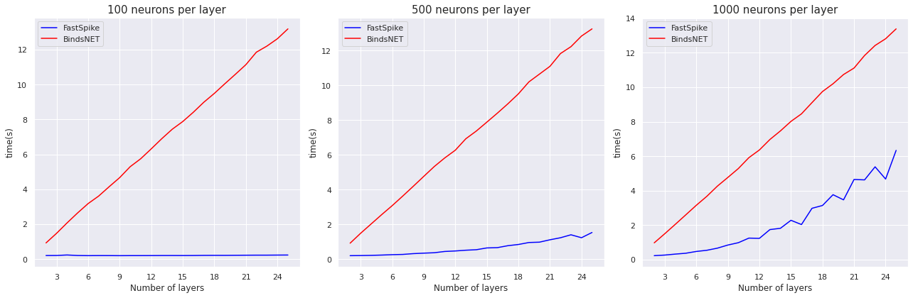

# FastSpike
A Spiking Neural Network (SNN) framework for fast simulation based on PyTorch

FastSpike is designed to exploit the GPU memory in order to increase the speed of simulation as much as possible. Right now, FastSpike only supports homogeneous networks (same characteristics for all neurons in a network). For CPU computing, heterogeneous networks, and a more memory-friendly framework, use [BindsNET](https://github.com/BindsNET/bindsnet).
The amount of speed-up achieved by FastSpike depends on the GPU capacity. Hence, it is important to use suitable hardware for your problem.

#Benchmarking
Here is a benchmark of FastSpike against BindsNET. The benchmark is done on a Tesla K80 (which is not a very fast GPU!) on Google Colab. It shows that generally, FastSpikes performs better when the number of network layers is high in relation to the total number of neurons. The relative performance of these two packages is dependent on the GPU capacity and more speed-up for FastSpike is expected on the better processor. The benchmark code is available on: [Colab Notebook](https://colab.research.google.com/drive/11SKxlbLxc6ZzXXDJkYf59Wu9ckvFZh6K?usp=sharing)

## Fixed size, Different number of layers

## Fixed number of layers, Different layer sizes
